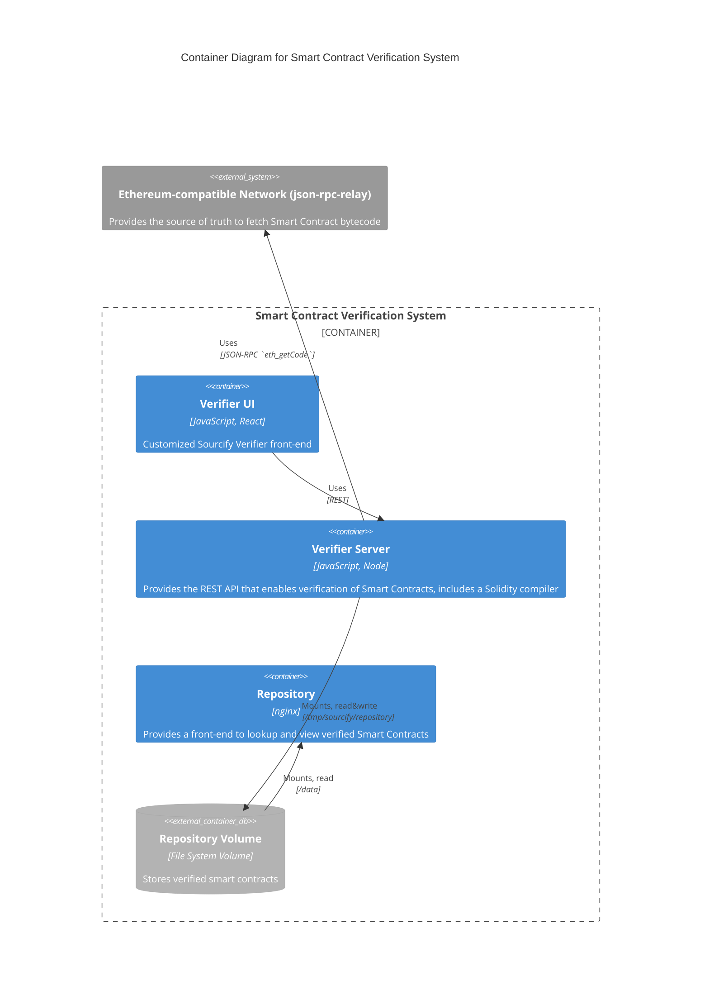

<div align="center">

# Hedera Sourcify

</div>

## Overview

Tools for verifying Hedera smart contracts using standard open source libraries.
The verification solution is based on Sourcify,
the Smart Contract verification service part of Ethereum.

## Prerequisites

Install

- [`node`](https://nodejs.org/en/about/) and [`npm`](https://www.npmjs.com/)
- [Docker](https://docs.docker.com/engine/reference/commandline/docker/)

Make sure both the `server` submodule [`sourcify`](./sourcify/) and the `repository` submodule [`h5ai-nginx`](./h5ai-nginx/) are present with

```sh
git submodule update --init --recursive
```

These repo submodules are `sourcify` and `h5ai-nginx`, which corresponds to the `server` and `repository` Sourcify upstream services respectively.
Instead of forking those repos, we attach them here directly in order to consume upstream updates more easily.
Given that the `ui` changes are Hedera specific, we decided to keep our [`ui`](./ui/) fork with custom modifications.

Apply the Hedera customization patch to the `sourcify` submodule **(execute this only once)**

```sh
npm run server:patch
```

## Quick Start

To start the services `server`, `repository` and `ui` run

```sh
docker compose up --detach
```

> This command uses the [`compose.yaml`](./compose.yaml) located in the root folder of the repo.
> Go to [Use Docker Images](#use-docker-images) for more details.

### Sanity Check the Configuration

Verify all the services are up and running.
This assumes the default ports (per `.env`) are used.

- Open <http://localhost:5555/chains>.
  This should return a JSON value containing the 3 Hedera public networks, **Hedera Mainnet**, **Hedera Testnet** and **Hedera Previewnet**, in addition to a few well-known development networks.
- Open <http://localhost:10000>.
  This should open the Repository `select-contract-form`.
  The options available for the _Chain_ selection should be networks described above.
- Open <http://localhost:5555/api-docs>.
  This should open the Open API docs showcasing all endpoints offered by the `server` service.
- Open <http://localhost:5555/files/contracts/296>.
  This should return a JSON value containing the addresses of all contracts verified on testnet (or report error `"Contracts have not been found!"` if nothing has been verified yet)
- Open <http://localhost:3001>.
  This should bring up the Verifier page.

## Local Development

### Run

To start the repository service, run

```sh
docker compose up --detach repository
```

To start the `server` run

```sh
cd sourcify
npm ci
npm run build:lerna
cp ../test/sourcify-chains.json ./services/server/dist/ 
npm run server:start
```

To start and bring up the UI, run in a different terminal

```sh
cd ui
npm ci
npm run start
```

See [README in `ui`](./ui/README.md) for more details.

To use the Mirror Node explorer with your verification instance, add this network entry to the array at `/app/networks-config.json`

```json
  {
    "name": "localnet2",
    "displayName": "LOCALNET2",
    "url": "http://localhost:5551/",
    "ledgerID": "02",
    "sourcifySetup": {
      "activate": true,
      "repoURL": "http://repository.local/contracts/",
      "serverURL": "http://localhost:5555/",
      "verifierURL": "https://localhost/#/",
      "chainID": 298
    }
  }
```

## Use Docker Images

> [!TIP]
> You may need to authenticate to the GitHub container registry `ghcr.io` using a Personal Access Token [as described here](https://docs.github.com/en/packages/working-with-a-github-packages-registry/working-with-the-container-registry) to pull the Docker images.

You can either use pre-built Docker images from the GitHub container repository
or build the images locally.

Hedera verification service uses 3 images

- [`server`](#server-service) **[Verifier Server]**. This service provides the actual verification of Smart Contracts.
Its main task is to compile input Solidity sources and check compiler results.
It checks compilers results against the bytecode retrieved from an Ethereum-compatible network, _e.g._, JSON-RPC Relay.
Other services interact with it through its REST API.
You can inspect the endpoints provided by visiting `/api-docs` (OpenAPI generated docs) on the `server`, _e.g._, <https://server-verify.hashscan.io/api-docs/>.
A successful verification stores the contracts sources under _Repository Volume_.
- [`repository`](#repository-service) **[Repository]**. Provides a verified Smart Contract front end lookup and explorer. It reads verified smart contracts from the _Repository Volume_.
- [`ui`](#ui-service) **[Verifier UI]**. A user frontend to verify and lookup Smart Contracts.

> [!NOTE]
> Note that unlike Sourcify, we do not use the [`monitor`](https://docs.sourcify.dev/docs/running-monitor/) service given that we do not use IPFS verification.
> That is, we only use `server` and `repository` services from upstream Sourcify.

Currently we host two UIs for contract verification, our custom UI <https://verify.hashscan.io/> and the `VERIFY CONTRACT` within <https://hashscan.io/>.
Both use the verification API <https://server-verify.hashscan.io/api-docs/>.

> The `ui` image needs some front-end customizations, therefore we keep our own fork of the image.



See [`compose.yaml`](./compose.yaml) for more details on how to setup and customize each service.

### Pulling pre-built images

Pull all needed images

```sh
docker compose pull
```

or each one individually

- `docker pull ghcr.io/hashgraph/hedera-sourcify/ui:main`
- `docker pull ghcr.io/hashgraph/hedera-sourcify/server:main`
- `docker pull ghcr.io/hashgraph/hedera-sourcify/repository:main`

### Build images

Run the following to build the `server`, `repository` and `ui` images locally

```sh
docker compose build
```

### Run

```sh
docker compose up --detach
```

Open <http://localhost:3001> to bring up the UI Verifier page.
You can visit <http://localhost:5555/api-docs/> to see the OpenAPI docs.
Verify your chain configuration is visible from <http://localhost:5555/chains>.
The repository path is `/tmp/sourcify/repository`

### Stop

Run

```sh
docker compose down
```

### Reset networks

> [!IMPORTANT]
> The reset script for Docker works by deleting the repository of verified contracts on the specified network (`testnet` and `previewnet`) through the `server` service.
> In order for it to work properly, the contracts repository **must** be mounted on `/data` in the `server` service.

To reset **testnet**

```sh
docker exec server-main /home/app/hedera-reset-docker.sh testnet
```

To reset **previewnet**

```sh
docker exec server-main /home/app/hedera-reset-docker.sh previewnet
```

## Configuration

The following tables describe the configuration items used by the different services

### _ui_ service

The _ui_ service is a single page application based on React.
As such, it cannot be configured by environment variables at runtime.
It reads its configuration from a file located at the following path `/usr/share/nginx/html/config.json`.
In deployment, the actual configuration can be provided to the container via a mount point.

Example contents for `config.json`

```json
{
    "SERVER_URL": "https://server.sourcify-integration.hedera-devops.com",
    "REPOSITORY_SERVER_URL": "https://repository.sourcify-integration.hedera-devops.com",
    "EXPLORER_URL": "http://localhost:8080",
    "BRAND_PRODUCT_LOGO_URL": "http://example.com/path/to/my-logo.jpg",
    "TERMS_OF_SERVICE_URL": "http://example.com/path/to/my-terms.html",
    "REMOTE_IMPORT": false,
    "GITHUB_IMPORT": false,
    "CONTRACT_IMPORT": false,
    "JSON_IMPORT": false,
    "OPEN_IN_REMIX": false,
    "CREATE2_VERIFICATION": false
}
```

The following properties can be provided in `config.json`

| Name                        | Description                                                                                     |
|-----------------------------|-------------------------------------------------------------------------------------------------|
| `SERVER_URL`                | URL of the server (from outside the cluster).                                                   |
| `REPOSITORY_SERVER_URL`     | HTTP port exposed by container                                                                  |
| `EXPLORER_URL`              | URL of the mirror-node explorer                                                                 |
| `BRAND_PRODUCT_LOGO_URL`    | URL of the header top left product logo (default is Hedera logo)                                |
| `TERMS_OF_SERVICE_URL`      | URL of the terms-of-service document linked from bottom of page (default is no link)            |
| `REMOTE_IMPORT`             | Flag to activate mode "Import from remote" (default is false)                                   |
| `GITHUB_IMPORT`             | Flag to activate mode "Import from GitHub" (default is false)                                   |
| `CONTRACT_IMPORT`           | Flag to activate mode "Import from contract's metadata" (default is false)                      |
| `JSON_IMPORT`               | Flag to activate mode "Import contracts from Solidity's Standard JSON Input" (default is false) |
| `OPEN_IN_REMIX`             | Flag to activate link "Open in Remix" (default is false)                                        |
| `CREATE2_VERIFICATION`      | Flag to activate create2 verification (default is false)                                        |

The favicon may be customized by providing alternative versions of the 3 following files: `manifest.json`, `favicon.ico`, `favicon-16x16.png`, `favicon-32x32.png` and passing them to the `ui` service via mount points.

This can be done for instance by adding the following to the definition of the `ui` service in the `compose.yaml` file used

```yaml
volumes:
  - type: bind
    source: ./manifest.json
    target: /usr/share/nginx/html/manifest.json
  - type: bind
    source: ./favicon.ico
    target: /usr/share/nginx/html/favicon.ico
  - type: bind
    source: ./favicon-16x16.png
    target: /usr/share/nginx/html/favicon-16x16.png
  - type: bind
    source: ./favicon-32x32.png
    target: /usr/share/nginx/html/favicon-32x32.png`
```

### _server_ service

The following settings are set in a `local.js` file needed by the _server_ at runtime

| Name                          | Example value                   | Description                                                                       |
|-------------------------------|---------------------------------|-----------------------------------------------------------------------------------|
| `server.port`                 | `5555`                              | HTTP port used inside container                                                   |
| `repositoryV1.path`             | /data                           | Path of the mount point of the verified contract repository (inside container)    |
| `solcRepo`                   | /home/data/solc-bin/linux-amd64 | Path where Solidity compiler binaries will be saved (inside container)            |
| `solJsonRepo`                | /home/data/solc-bin/soljson     | Path where Solidity JS compilers will be saved (inside container)                 |
| `corsAllowdOrigins`              | `[/^https?:\/\/(?:.+\.)?sourcify.dev$/]`                     | List of regexes that will be allowed by CORS inside the server |

> [!TIP]
> See server's [`README`](./sourcify/services/server/README.md) for more details.

This [`sourcify-chains.json`](./sourcify-chains.json) should be used to configure Hedera chains.
The `host.docker.internal` hostname is used to make connections between containers.
See <https://docs.docker.com/desktop/networking/#use-cases-and-workarounds> for more details.

```json
{
  "295": {
    "sourcifyName": "Hedera Mainnet",
    "supported": true
  },
  "296": {
    "sourcifyName": "Hedera Testnet",
    "supported": true
  },
  "297": {
    "sourcifyName": "Hedera Previewnet",
    "supported": true
  },
  "298": {
    "sourcifyName": "Hedera Localnet",
    "supported": true,
    "rpc": [
      "http://host.docker.internal:7546"
    ]
  }
}
```

You can customize OpenAPI _Servers_ list by changing the `servers.yaml` file.
For example

```yaml
- description: The current REST API server
  url: ""
- description: The production REST API server
  url: "https://server-verify.hashscan.io"
- description: The staging REST API server
  url: "https://server-sourcify.hedera-devops.com"
- description: Local development server address on default port 5002
  url: "http://localhost:5002"
```

### _repository_ service

The _repository_ service encompasses a single page application based on React and a web server.

In deployment, the actual configuration can be provided to the container via the same mount point as the one provided to the _ui_,
even though the only useful item for the _repository_ is the following
`"SERVER_URL": "https://server.sourcify-integration.hedera-devops.com"` value.

## Tests

Given we leverage the Sourcify code base as is,
we maintain only a subset of Sourcify server tests against a local chain and a basic non-regression server test using Hedera local node.

### Sourcify Server

First compile the Sourcify server.
`cd ./sourcify` and run

```sh
npm ci
npm run build:lerna
```

Then (from the repo root) run the Sourcify server tests with

```sh
npm run test:server
```

> [!IMPORTANT]
> **Do not update** the `ganache` dependency.
> Its latest version `7.9.2` (and most probably the last one given Ganache is no longer supported)
> has some dependency issues that for some reason makes `fsevents` non-optional.
> This in turn makes non-`darwin` installations, _e.g._, Github Actions jobs, to fail when running `npm ci` with
>
> ```console
> npm ERR! notsup Unsupported platform for fsevents@2.3.2: wanted {"os":"darwin"} (current: {"os":"linux"})
> ```

### Hedera

The Hedera local node variables `HEDERA_NETWORK`, `OPERATOR_ACCOUNT_ID` and `OPERATOR_KEY` are defined in [`test/.env.test`](./test/.env.test).

Start Hedera local node with

```sh
npm run local-node:start
```

In another terminal session, `cd ./sourcify` and start the Sourcify server with

```sh
npm ci
npm run build:lerna
cp ../test/sourcify-chains.json ./services/server/dist/ 
npm run server:start
```

> [!NOTE]
> The `sourcify-chains.json` is used to setup both the chain ID and JSON-RPC for the `Hedera Localnet` network.

Finally (from the repo root) run the server tests

```sh
npm run test:hedera
```

## Tools

See [`tools`](./tools/README.md) folder to setup development environments to work with a custom verification deployment.

## Releases

To release a new version `X.Y.Z` follow the next steps.

First, create a release branch.
For example use the name `release/X.Y` for a minor release.
Bump versions in a new PR against this release branch to the target version, `X.Y.Z-rc1` and merge it back into the release branch, _i.e._, `release/X.Y`.

Create another PR against `main` for snapshot bumping, _i.e._,`X.(Y+1).0-SNAPSHOT`.
Only perform this step for `rc` releases, for `ga` releases there should be already a `release/X.Y` branch.

The repo has Github Actions automation to generate Docker images based on the latest changes in a branch.
To trigger image generation in GitHub Actions for release version `X.Y.Z` push a new tag using the following commands

```sh
git checkout release/X.Y
git pull
git tag vX.Y.Z
git push origin vX.Y.Z
```

When the workflow is done, the images should be published under <https://github.com/orgs/hashgraph/packages?repo_name=hedera-sourcify>.
Verify that everything works as expected.
You can use the following checklist to make sure the new release, either integration or production, was successful.

- [ ] **Check available Hedera public networks.** Make sure both the endpoint <https://server-verify.hashscan.io/chains> and _Chain_ select list in <https://repository-verify.hashscan.io/select-contract/> returns the Hedera public networks, `mainnet`, `testnet` and `previewnet`.
- [ ] **Check `servers` list.** Make sure _Servers_ listed in <https://server-verify.hashscan.io/api-docs/> are properly set to Hedera and local servers.
- [ ] **Verify a contract using Hashscan.** Deploy a contract with your favorite tool. Verify it using the `VERIFY CONTRACT` button in the _Contract_ view in Hashscan. Make sure the verified contract is visible from the `repository`. See [How to Verify a Smart Contract on HashScan](https://docs.hedera.com/hedera/tutorials/smart-contracts/how-to-verify-a-smart-contract-on-hashscan) for more details.
- [ ] **Verify a contract using the Verifier UI**. Deploy a contract with your favorite tool. Verify it using the Verifier UI. Make sure the verified contract is visible from the `repository`. Make sure the verified contract is visible as such in the _Contract_ view in Hashscan.
- [ ] **Verify a contract using a Hardhat project**. Make sure the [`hardhat-verify`](https://hardhat.org/hardhat-runner/plugins/nomicfoundation-hardhat-verify#verifying-on-sourcify) plugin is able to verify a contract in the deployed instance. See [tools/README](./tools/README.md) for more details.
- [ ] **Verify a contract using a Foundry project**. Make sure the [`forge create` and `forge-contract`](https://book.getfoundry.sh/forge/deploying) commands are able to verify a contract in the deployed instance. See [tools/README](./tools/README.md) for more details.
- [ ] **Ensure your deployed contracts are listed.** Use the endpoint <https://server-verify.hashscan.io/files/contracts/296> (change the domain if necessary) and make sure the deployed contracts are listed there.

Once you ensure the new release works properly, create a GitHub Release to let users and developers of what has changed.
Go to <https://github.com/hashgraph/hedera-sourcify/releases> and follow the steps under _Draft a new release_.

## Support

If you have a question on how to use the product, please see our
[support guide](https://github.com/hashgraph/.github/blob/main/SUPPORT.md).

## Contributing

Contributions are welcome. Please see the
[contributing guide](https://github.com/hashgraph/.github/blob/main/CONTRIBUTING.md)
to see how you can get involved.

## Code of Conduct

This project is governed by the
[Contributor Covenant Code of Conduct](https://github.com/hashgraph/.github/blob/main/CODE_OF_CONDUCT.md).
By participating, you are expected to uphold this code of conduct.
Please report unacceptable behavior to [oss@hedera.com](mailto:oss@hedera.com).

## License

[Apache License 2.0](LICENSE)

## 🔐 Security

Please do not file a public ticket mentioning the vulnerability.
Refer to the security policy defined in the [SECURITY.md](https://github.com/hashgraph/hedera-sourcify/blob/main/SECURITY.md).
