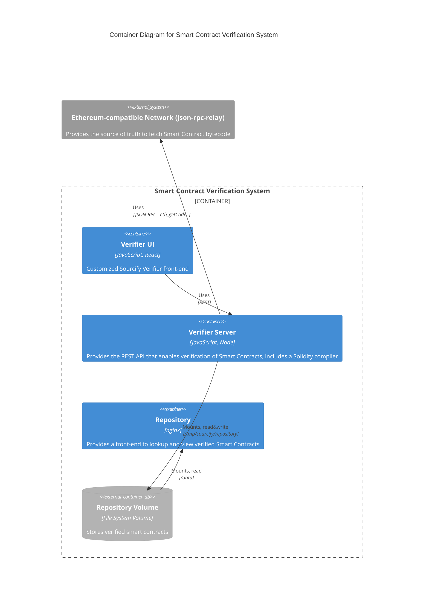

<div align="center">

# Hedera Sourcify

</div>

## Overview

Tools for verifying Hedera smart contracts using standard open source libraries.
The verification solution is based on Sourcify,
the Smart Contract verification service part of Ethereum.

## Prerequisites

Install

- [`node`](https://nodejs.org/en/about/) and [`npm`](https://www.npmjs.com/)
- [Docker](https://docs.docker.com/engine/reference/commandline/docker/)

Make sure both the server submodule `sourcify` and the repository submodule `h5ai-nginx` are present with

```sh
git submodule update --init --recursive
```

## Quick Start

To start the services `server`, `repository` and `ui` run

```sh
docker compose up --detach
```

> This command uses the `compose.yaml` located in the root folder of the repo.

### Sanity Check the Configuration

Verify all the services are up and running.
This assumes the default ports (per `.env`) are used.

- Open <http://localhost:10000>.
  This should open the Repository `select-contract-form`.
  The options available for the Chain should be the 3 Hedera networks (**Hedera Mainnet**, **Hedera Testnet** and **Hedera Previewnet**).
- Open <http://localhost:5555/chains>.
  This should return a JSON value containing the 3 Hedera networks
- Open <http://localhost:5555/api-docs>.
  This should open the Open API docs showcasing all endpoints offered by the `server` service.
- Open <http://localhost:5555/files/contracts/296>.
  This should return a JSON value containing the addresses of all contracts verified on testnet (or report error `"Contracts have not been found!"` if nothing has been verified yet)
- Open <http://localhost:3001>.
  This should bring up the Verifier page.

## Local build for development

### Steps

From the root of the project workspace:

1. Run `npm ci`. This will create populate and link `node_modules`.
2. `cp environments/.env.dev.hedera  environments/.env`
3. Make sure the following variables defined in `.env` point to directories which exist on the file system: `REPOSITORY_PATH, SOLC_REPO, SOLJSON_REPO` (paths relative to the environments/ directory)
4. `cp environments/example-docker-config.json environments/docker-config.json`
   - Adjust as needed. With local build, this is used by the repository container, which only needs the SERVER_URL
5. Run `npx lerna bootstrap && npx lerna run build`. This will build the server and ui as well as needed libraries.
6. Run `docker-compose -f environments/build-repository.yaml build`. This will build the docker image for the repository service.

### Run

To start the repository service, run

```sh
docker compose up --detach server repository
```

Run `npm run server:start`. This will start the server.

To start and bring up the UI, run in a different terminal

```sh
cd ui
npm run start
```

## Use Docker Images

You can either use pre-built Docker images from the GitHub container repository
or build the images locally.

Hedera verification service uses 3 images

- [`server`](#server-service) **[Verifier Server]**. This service provides the actual verification of Smart Contracts.
Its main task is to compile input Solidity sources and check compiler results.
It checks compilers results against the bytecode retrieved from an Ethereum-compatible network, _e.g._, JSON-RPC Relay.
Other services interact with it through its REST API.
You can inspect the endpoints provided by visiting `/api-docs` (OpenAPI generated docs) on the `server`, _e.g._, <https://server-verify.hashscan.io/api-docs/>.
A successful verification stores the contracts sources under _Repository Volume_.
- [`repository`](#repository-service) **[Repository]**. Provides a verified Smart Contract front end lookup and explorer. It reads verified smart contracts from the _Repository Volume_.
- [`ui`](#ui-service) **[Verifier UI]**. A user frontend to verify and lookup Smart Contracts.

> [!NOTE]
> Note that unlike Sourcify, we do not use the [`monitor`](https://docs.sourcify.dev/docs/running-monitor/) service given that we do not use IPFS verification.
> That is, we only use `server` and `repository` services from upstream Sourcify.

Currently we host two UIs for contract verification, our custom UI <https://verify.hashscan.io/> and the `VERIFY CONTRACT` within <https://hashscan.io/>.
Both use the verification API <https://server-verify.hashscan.io/api-docs/>.

> The `ui` image needs some front-end customizations, therefore we keep our own fork of the image.



### Set-up

1. `cp environments/.env.docker.hedera  environments/.env`
2. Adjust the configuration in `environments/.env` as follows:
    - Replace all occurrences of `localhost` by the fully qualified hostname if not running locally
3. `cp environments/example-docker-config.json  environments/docker-config.json`
    - Adjust the URLs in `docker-config.json` as needed
4. You may need to authenticate to the GitHub container registry at `ghcr.io` using a personal access token [as described here](https://docs.github.com/en/packages/working-with-a-github-packages-registry/working-with-the-container-registry).

### Pulling pre-built images

- Run `docker pull ghcr.io/hashgraph/hedera-sourcify/ui:main`
- Run `docker pull ghcr.io/hashgraph/hedera-sourcify/server:main`
- Run `docker pull ghcr.io/hashgraph/hedera-sourcify/repository:main`
- Then follow _Run_ step below.

### Build images

Run the following to build the `server`, `repository` and `ui` images locally

```sh
docker compose build
```

### Run

1. Run `docker compose up --detach`
2. Open <http://localhost:3001> to bring up the Verifier page.

### Stop

- Run `docker compose down`

### Reset networks

To reset **testnet**

```sh
docker exec server-main /home/app/hedera-reset-docker.sh testnet
```

To reset **previewnet**

```sh
docker exec server-main /home/app/hedera-reset-docker.sh previewnet
```

## Configuration

The following tables describe the configuration items used by the different services

### _ui_ service

The _ui_ service is a single page application based on React.
As such, it cannot be configured by environment variables at runtime.
It reads its configuration from a file located at the following path `/usr/share/nginx/html/config.json`.
In deployment, the actual configuration can be provided to the container via a mount point.

Example contents for `config.json`

```json
{
    "SERVER_URL": "https://server.sourcify-integration.hedera-devops.com",
    "REPOSITORY_SERVER_URL": "https://repository.sourcify-integration.hedera-devops.com",
    "EXPLORER_URL": "http://localhost:8080",
    "BRAND_PRODUCT_LOGO_URL": "http://example.com/path/to/my-logo.jpg",
    "TERMS_OF_SERVICE_URL": "http://example.com/path/to/my-terms.html",
    "REMOTE_IMPORT": false,
    "GITHUB_IMPORT": false,
    "CONTRACT_IMPORT": false,
    "JSON_IMPORT": false,
    "OPEN_IN_REMIX": false,
    "CREATE2_VERIFICATION": false
}
```

The following properties can be provided in `config.json`

| Name                        | Description                                                                                     |
|-----------------------------|-------------------------------------------------------------------------------------------------|
| `SERVER_URL`                | URL of the server (from outside the cluster).                                                   |
| `REPOSITORY_SERVER_URL`     | HTTP port exposed by container                                                                  |
| `EXPLORER_URL`              | URL of the mirror-node explorer                                                                 |
| `BRAND_PRODUCT_LOGO_URL`    | URL of the header top left product logo (default is Hedera logo)                                |
| `TERMS_OF_SERVICE_URL`      | URL of the terms-of-service document linked from bottom of page (default is no link)            |
| `REMOTE_IMPORT`             | Flag to activate mode "Import from remote" (default is false)                                   |
| `GITHUB_IMPORT`             | Flag to activate mode "Import from GitHub" (default is false)                                   |
| `CONTRACT_IMPORT`           | Flag to activate mode "Import from contract's metadata" (default is false)                      |
| `JSON_IMPORT`               | Flag to activate mode "Import contracts from Solidity's Standard JSON Input" (default is false) |
| `OPEN_IN_REMIX`             | Flag to activate link "Open in Remix" (default is false)                                        |
| `CREATE2_VERIFICATION`      | Flag to activate create2 verification (default is false)                                        |

#### Customizing the favicon

The favicon may be modified by providing alternative versions of the 3 following files: `manifest.json`, `favicon.ico`, `favicon-16x16.png`, `favicon-32x32.png` and passing them to the `ui` service via mount points.

This can be done for instance by adding the following to the definition of the `ui` service in the `docker-compose` yaml file used:

```yaml
volumes:
  - type: bind
    source: ./manifest.json
    target: /usr/share/nginx/html/manifest.json
  - type: bind
    source: ./favicon.ico
    target: /usr/share/nginx/html/favicon.ico
  - type: bind
    source: ./favicon-16x16.png
    target: /usr/share/nginx/html/favicon-16x16.png
  - type: bind
    source: ./favicon-32x32.png
    target: /usr/share/nginx/html/favicon-32x32.png`
```

### _server_ service

The following environment variables are needed by the _server_ at runtime:

| Name                          | Example value                   | Description                                                                       |
|-------------------------------|---------------------------------|-----------------------------------------------------------------------------------|
| `REPOSITORY_PATH`             | /data                           | Path of the mount point of the verified contract repository (inside container)    |
| `REPOSITORY_PATH_HOST`        | ../../data/repository           | Path of the verified contract repository (on host machine)                        |
| `SOLC_REPO`                   | /home/data/solc-bin/linux-amd64 | Path where Solidity compiler binaries will be saved (inside container)            |
| `SOLJSON_REPO`                | /home/data/solc-bin/soljson     | Path where Solidity JS compilers will be saved (inside container)                 |
| `SOLC_REPO_HOST`              | ../../data/solc-bin/linux-amd64 | Path for the Solidity compiler binaries downloaded (on host machine)              |
| `SOLJSON_REPO_HOST`           | ../../data/solc-bin/soljson     | Path for the Solidity JS compilers downloaded (on host machine)                   |
| `SERVER_PORT`                 | 80                              | HTTP port used inside container                                                   |
| `SERVER_EXTERNAL_PORT`        | 5002                            | HTTP port exposed by container                                                    |
| `UI_DOMAIN_NAME`              | example.com                     | Fully qualified domain name of the host running the ui                            |
| `REPOSITORY_SERVER_URL`       | repository.example.com          | URL of repository server (from outside the cluster)                               |
| `TESTING`                     | false                           | DO NOT CHANGE                                                                     |
| `TAG`                         | latest                          | Added to the docker image tags (e.g. ui-latest, server-latest, repository-latest) |

> [!TIP]
> See server's [`README`](./sourcify/services/server/README.md) for more details.

### _repository_ service

The _repository_ service encompasses a single page application based on React and a web server.

- Similar to the _ui_, the React part reads it configuration from a file located at the following path: `/redirects/config.json`
In deployment, the actual configuration can be provided to the container via the same mount point as the one provided to the _ui_,
even though the only useful item for the _repository_ is the following:
`"SERVER_URL": "https://server.sourcify-integration.hedera-devops.com"` value

- The web server part needs the following environment variables at runtime:

| Name                              | Example value         | Description                                                                            |
|-----------------------------------|-----------------------|----------------------------------------------------------------------------------------|
| `REPOSITORY_PATH`                 | `../../data/repository` | Path of the contract repository on the host.                                           |
| `REPOSITORY_SERVER_EXTERNAL_PORT` | `10000`                 | HTTP port exposed by container                                                         |
| `UI_DOMAIN_NAME`                  | `example.com`           | Fully qualified domain name of the host running the ui                                 |
| `TESTING`                         | `false`                 | DO NOT CHANGE                                                                          |
| `TAG`                             | `latest`                | Added to the docker image tags (e.g. ui-latest, server-latest, repository-latest)      |

## Test

Given we leverage the Sourcify code base as is, we maintain only a basic non-regression server test.

The Hedera local node variables `HEDERA_NETWORK`, `OPERATOR_ACCOUNT_ID` and `OPERATOR_KEY` are defined in [`test/.env.test`](./test/.env.test).

Start Hedera Local Node with

```sh
npm run local-node:start
```

In another terminal session, `cd` to `./sourcify` and run

```sh
npm ci
npm run build:lerna
cp ../test/sourcify-chains.json ./services/server/dist/ 
npm run server:start
```

Finally, run the server tests

```sh
npm run test:hedera
```

## Images

### Start the verification server <https://docs.sourcify.dev/docs/running-server/>

This `sourcify-chains.json` should be used to configure Hedera chains.
The `host.docker.internal` hostname is used to make connections between containers.
See <https://docs.docker.com/desktop/networking/#use-cases-and-workarounds> for more details.

```json
{
  "295": {
    "sourcifyName": "Hedera Mainnet",
    "supported": true
  },
  "296": {
    "sourcifyName": "Hedera Testnet",
    "supported": true
  },
  "297": {
    "sourcifyName": "Hedera Previewnet",
    "supported": true
  },
  "298": {
    "sourcifyName": "Hedera Localnet",
    "supported": true,
    "rpc": [
      "http://host.docker.internal:7546"
    ]
  }
}
```

Use this environment file `.env.sourcify.dev` to avoid CORS errors

```bash
NODE_ENV=development
```

Then run pull the image

```bash
docker pull ghcr.io/ethereum/sourcify/server:staging
```

and run it

```sh
docker run \
  --detach \
  --publish 5555:5555 \
  --volume ./sourcify-chains.json:/home/app/services/server/dist/sourcify-chains.json \
  --volume ./servers.yaml:/home/app/services/server/dist/servers.yaml \
  --volume ./data:/tmp/sourcify/repository \
  --env-file .env.sourcify.dev \
  --name sourcify-server \
  ghcr.io/ethereum/sourcify/server:staging
```

You can visit <http://localhost:5555/api-docs/> to see the OpenAPI docs. Verify your configuration is visible from <http://localhost:5555/chains>.

- The repository path is `/tmp/sourcify/repository`

### Start the repository service

**The repository is needed, but probably we want to use the DB image which is not published yet.**

```sh
docker pull ghcr.io/ethereum/sourcify/repository:staging
```

```sh
docker run \
  --detach \
  --publish 10000:80 \
  --env SERVER_URL='http://localhost:5555' \
  -v ./dat2:/data
  --name repo \
  ghcr.io/ethereum/sourcify/repository:staging
```

<https://github.com/sourcifyeth/h5ai-nginx?tab=readme-ov-file#h5ai-nginx-docker>

> Not sure when they are going to move database (their own, not the alliance) into production.

- The `SERVER_URL` is injected at `run` time.

### Start the UI service `hedera-sourcify`

Use the following `ui-config.json` to configure the `SERVER_URL` set up in the previous step

```json
  {
    "SERVER_URL": "http://localhost:5555",
    "REPOSITORY_SERVER_URL": "http://localhost:10000",
    "EXPLORER_URL": "http://localhost:8080",
    "BRAND_PRODUCT_LOGO_URL": "",
    "TERMS_OF_SERVICE_URL": "",
    "REMOTE_IMPORT": false,
    "GITHUB_IMPORT": false,
    "CONTRACT_IMPORT": false,
    "JSON_IMPORT": false,
    "OPEN_IN_REMIX": false,
    "CREATE2_VERIFICATION": false
  }
```

```bash
docker pull ghcr.io/hashgraph/hedera-sourcify:ui-main
```

```bash
docker run --detach --publish 80:80 --volume ./ui-config.json:/usr/share/nginx/html/config.json --name ui ghcr.io/hashgraph/hedera-sourcify:ui-main
```

### Start the upstream UI service <https://docs.sourcify.dev/docs/running-ui/>

```bash
docker pull ghcr.io/ethereum/sourcify/ui:staging
```

```bash
docker run --detach --publish 80:80 ghcr.io/ethereum/sourcify/ui:staging
```

Visit homepage at <http://localhost/> and the verifier page <http://localhost/#/verifier>.

Add this network entry to the array at `/app/networks-config.json`

```json
  {
    "name": "localnet2",
    "displayName": "LOCALNET2",
    "url": "http://localhost:5551/",
    "ledgerID": "02",
    "sourcifySetup": {
      "activate": true,
      "repoURL": "http://repository.local/contracts/",
      "serverURL": "http://localhost:5555",
      "verifierURL": "https://localhost/#/",
      "chainID": 298
    }
  }

```

Customize OpenAPI servers <https://github.com/ethereum/sourcify/issues/1345>

```yaml
- description: The current REST API server
  url: ""
- description: The production REST API server
  url: "https://server-verify.hashscan.io"
- description: The staging REST API server
  url: "https://server-sourcify.hedera-devops.com"
- description: Local development server address on default port 5002
  url: "http://localhost:5002"
```

## Tools

See [tools](./TOOLS.md)

## UI Development

See [README in ui](./ui/README.md)

## Releases

The repo has Github Actions automation to generate docker images based on the latest changes in a branch.
To initiate the release for version `x.y.z` simply checkout branch `release/x.y` and run the following commands

```sh
git tag vx.y.z
git push origin vx.y.z
```

---

# Release Plan

- Create a release branch, minor release 0.2, name of the branch, _e.g._,`release/0.2`
- Bump versions in a new PR against release branch to the target version, `0.2.0-rc1` and merge it back into the release branch, _e.g._, `release/0.2`
- Create PR against `main` for snapshot bump, _e.g._,`0.3.0-SNAPSHOT` (only for `rc` releases, for `ga` releases there is already a `release/*` branch)
- Tag new version, this will trigger image creation in the `hedera-sourcify` GitHub Actions

```bash
git checkout release/0.2
git pull
git tag v0.2.0
git push origin v0.2.0
```

- When the workflow is done, the images should be published under <https://github.com/hashgraph/hedera-sourcify/pkgs/container/hedera-sourcify>
- Verify that everything works as expected, make a contract verification using the UI

# Hotfix

Bump to version 0.1.1 against release branch

Tag new version (this will trigger image creation for target version)

Deploy on Kubernetes

Test

## Support

If you have a question on how to use the product, please see our
[support guide](https://github.com/hashgraph/.github/blob/main/SUPPORT.md).

## Contributing

Contributions are welcome. Please see the
[contributing guide](https://github.com/hashgraph/.github/blob/main/CONTRIBUTING.md)
to see how you can get involved.

## Code of Conduct

This project is governed by the
[Contributor Covenant Code of Conduct](https://github.com/hashgraph/.github/blob/main/CODE_OF_CONDUCT.md).
By participating, you are expected to uphold this code of conduct.
Please report unacceptable behavior to [oss@hedera.com](mailto:oss@hedera.com).

## License

[Apache License 2.0](LICENSE)

## 🔐 Security

Please do not file a public ticket mentioning the vulnerability.
Refer to the security policy defined in the [SECURITY.md](https://github.com/hashgraph/hedera-sourcify/blob/main/SECURITY.md).
